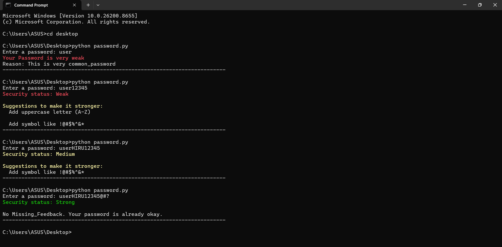

<h1 align="center">🔒 Password Strength Checker</h1>
<p align="center">
  <b>A Python CLI tool to evaluate password security with color-coded feedback</b>
</p>

<p align="center">
  
</p>

---

✨ Features

- *🚫 Blocks Common Passwords*: Instantly flags password, 123456, admin etc.
- *📊 4-Point Security Score*: Checks for 8+ Length, Uppercase, Lowercase, Symbols
- *🎨 Color-Coded Results*: 
    - <span style="color:red">Red</span> = Very Weak / Weak
    - <span style="color:#FFD700">Yellow</span> = Medium 
    - <span style="color:green">Green</span> = Strong
- *💡 Actionable Suggestions*: Tells you exactly what's missing

---

🚀 How It Works

The script scores your password from 0 to 4:

| Score | Status      | Meaning                |
| :---: | :---------: | :--------------------: |
| 0-1   | Very Weak   | Fails most checks      |
| 2     | Weak        | Meets 2 criteria       |
| 3     | Medium      | Meets 3 criteria       |
| 4     | Strong      | Meets all 4 criteria   |

---

## 🛠️ Tech Stack

Python 3 | ANSI Escape Codes | CLI

---

▶️ Getting Started

### 1. Clone the repository
```bash
git clone https://github.com/your-username/password-checker.git
cd password-checker
```
### 2. Run the script
```bash
python password.py
```
### 3. Test it
```
EXAMPLE:
Enter a password: userHIRU12345@#?

Security status: Strong

No Missing_Feedback. Your password is already okay.
```

---

📈 Roadmap / Next Steps

- [ ] Add Number 0-9 check 
- [ ] Add Password Entropy calculation
- [ ] Build a GUI version with Tkinter or Streamlit

---
```
```
<p align="center">
  Built with ❤️ as part of my #100DaysOfCode journey
  <br/>
  PRs and ⭐ Stars are welcome!
</p>
